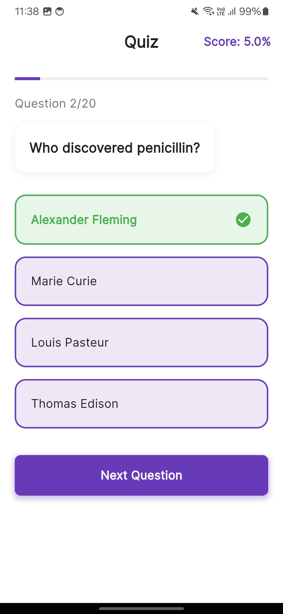
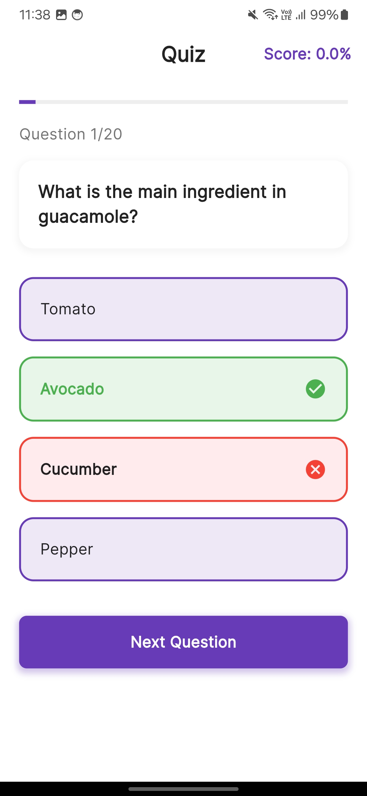
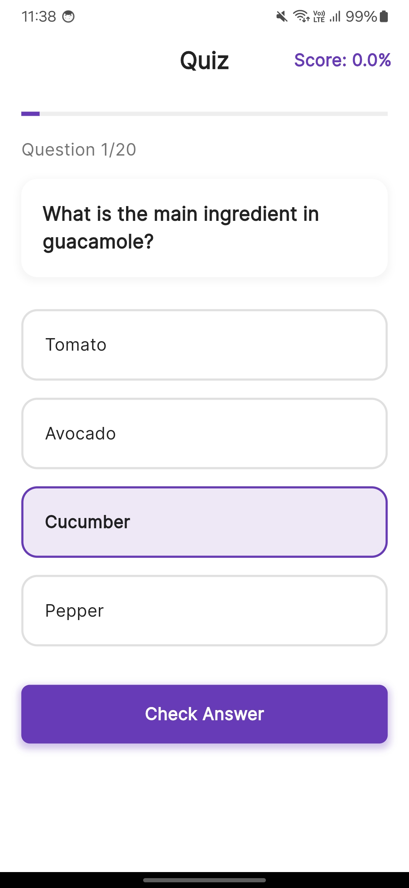

# Flutter Quiz App with Node.js Backend

A dynamic quiz application built with Flutter for the frontend and Node.js for the backend. This application allows users to take quizzes, track their progress, and compete with others through a real-time leaderboard system.

## Features

- User authentication and profile management
- Multiple quiz categories
- Real-time score tracking
- Interactive quiz interface with timer
- Progress tracking and statistics
- Global leaderboard
- Offline mode support
- Performance analytics

## Technology Stack

### Frontend
- Flutter SDK
- Provider for state management
- Shared Preferences for local storage
- HTTP package for API integration
- Flutter Secure Storage for sensitive data

### Backend
- Node.js with Express
- MongoDB for database
- JWT for authentication
- Socket.io for real-time features
- Mongoose ODM

## Prerequisites

Before running this application, make sure you have the following installed:
- Flutter (2.0 or higher)
- Node.js (14.x or higher)
- MongoDB (4.x or higher)
- Git

## Installation

### Backend Setup

1. Clone the repository:
```bash
git clone https://github.com/yourusername/quiz-app.git
cd quiz-app/backend
```

2. Install dependencies:
```bash
npm install
```

3. Create a `.env` file in the backend directory with the following variables:
```
PORT=3000
MONGODB_URI=mongodb://localhost:27017/quiz_app
JWT_SECRET=your_jwt_secret
```

4. Start the server:
```bash
npm run dev
```

### Frontend Setup

1. Navigate to the frontend directory:
```bash
cd ../frontend
```

2. Install Flutter dependencies:
```bash
flutter pub get
```

3. Update the API endpoint in `lib/config/config.dart`:
```dart
class Config {
  static const String apiUrl = 'http://your-backend-url:3000';
}
```

4. Run the application:
```bash
flutter run
```
## UI of app
### UI of the app






## API Endpoints

### Authentication
- `POST /api/auth/register` - User registration
- `POST /api/auth/login` - User login
- `GET /api/auth/profile` - Get user profile

### Quiz
- `GET /api/quizzes` - Get all quizzes
- `GET /api/quizzes/:id` - Get specific quiz
- `POST /api/quizzes/submit` - Submit quiz answers
- `GET /api/leaderboard` - Get global leaderboard

## Project Structure

```
quiz_app/
├── backend/
│   ├── controllers/
│   ├── models/
│   ├── routes/
│   ├── middleware/
│   └── server.js
└── frontend/
    ├── lib/
    │   ├── models/
    │   ├── screens/
    │   ├── services/
    │   ├── widgets/
    │   └── main.dart
    └── pubspec.yaml
```

## Contributing

1. Fork the repository
2. Create your feature branch (`git checkout -b feature/AmazingFeature`)
3. Commit your changes (`git commit -m 'Add some AmazingFeature'`)
4. Push to the branch (`git push origin feature/AmazingFeature`)
5. Open a Pull Request

## Security

- All API endpoints are protected with JWT authentication
- Passwords are hashed using bcrypt
- Input validation is implemented on both frontend and backend
- CORS is configured for security
- Rate limiting is implemented to prevent abuse

## Testing

### Backend
```bash
npm run test
```

### Frontend
```bash
flutter test
```

## Deployment

### Backend
The Node.js backend can be deployed to platforms like:
- Heroku
- DigitalOcean
- AWS Elastic Beanstalk

### Frontend
The Flutter app can be deployed to:
- Google Play Store
- Apple App Store
- Web hosting platforms (for web version)

## License

This project is licensed under the MIT License - see the [LICENSE.md](LICENSE.md) file for details

## Support

For support, email support@quizapp.com or join our Slack channel.

## Acknowledgments

- Flutter team for the amazing framework
- Node.js community for excellent packages
- MongoDB team for the robust database
- All contributors who have helped with the project